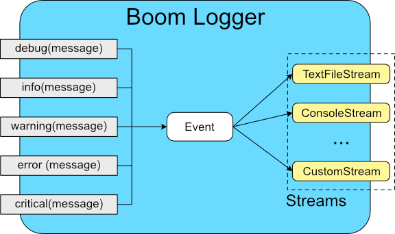

# **Boom Logger**
> **Warning**
> Boom requires C++ 17 or higher to compile. This should be available in most modern environments, please check your IDE's documentation on how to enable it

Boom is a logging library that is easy to use and light-weight while still being customizable.

## Simple example

The most basic example is as follows:
* Include the single *BoomLog.hpp* header file
* Where you want to log a piece of data, add the code:
``` c++
boom::Log::info("Data to be logged");
```

That's it! With this example your message will be output to the console as well as written to a file called *log.txt*

---
## Concepts

While the first example works, chances are that you need something a bit more specific. This is done by configuring the logger using **streams**.

Before configuring it would help to understand how the boom logger works. 



### Event Levels
When a message is logged it is given a level, which will determine how it is later handled. There are 5 categories:

1. **Debug** - Data being used for debugging during development  
    *Variable values, states, events, etc*  
    Created by calling **boom::Log::debug(message, [caller], [code])**
> **Note**
> Debug messages will only be handled in debug builds. They will be ignored in release builds  
To display debug messages in a release build, call **miniLog::Log::forceDebug(true)**

2. **Info** - Something expected occurred  
    *Something is loaded, the user has taken an action, etc*  
    Created by calling **boom::Log::info(message, [caller], [code])**

3. **Warning** - Something unexpected happened  
    *A file was not found, a connection was not made, the user entered invalid input*  
    Created by calling **boom::Log::warning(message, [caller], [code])**

4. **Error** - A non-fatal problem has occurred  
    *An exception has been caught and handled*  
    Created by calling **boom::Log::error(message, [caller], [code])**

5. **Critical** - A fatal exception has occured, program may crash  
    *Buffer overflow, pointer error, etc*  
    Created by calling **boom::Log::critical(message, [caller], [code])**

---
## Configuring boom
Boom's behaviour is changed through the use of **Streams**.
Each stream listens to one or more type (or **level**) of event and does something with it.

We do this in two steps:
1. Choose what streams to load
2. Tell each loaded stream what inputs to listen to

To understand your logger's behaviour it can be useful to draw it out as a grid:

| Streams | Debug | Info | Warning | Error | Critical |
|:-------:|:-----:|:----:|:-------:|:-----:|:--------:|
| TextFile | | | x | x | x |
| Console | x | x | x | | |
| Archive | x | x | x | x | x |


### Loading Streams

Create the stream and then add it to the logger by calling the addStream function. When adding a stream we also give it a name so we can access it later.

```c++
TextFileStream * tfs = new TextFileStream();
boom::Log::addStream("StreamName", tfs);
```
Just remember to clean up the stream when you no longer need it. Remove it from the logger using the removeStream function, then delete the original object:

``` c++
auto toRemove = boom::Log::removeStream("StreamName");
// If you created the stream as a pointer you will need to delete it
delete(toRemove);
// if you created the stream as an object it should go out of scope on its own (you still need to remove it from the logger)
``` 

### Setting levels in streams
By default a stream listens to all levels of events. To specify what levels a stream listens to use the **boom::Log::setLevels()** function and pass in the levels that you want to use
``` c++
// tell the stream to listen for debug and warning events
myStream.setLevels(boom::LEVELS::DEBUG | boom::LEVELS::WARNING)
```

miniLog comes with several types of streams:
- **Textfile Stream:** writes events to a text file
- **Console Stream:** writes event directly onto a console
- **Archive Stream:** store the events for later processing

You can also create custom streams (Instructions below)

By default, the Log will be configured with a TextFile Stream (with an id of *defaultTextFile*) and a Console Stream (*defaultConsole*), both of which listen to all levels. These can be modified or removed just like all other streams.


### **Events**
When you log a message an **Event** is created. These events contain the following data:
* **Timestamp-** When the event was created. This is automatically set when the event is created
* **Level-** As described above. This is automatically set based on what function creates it
* **Message-** A description of what happened, set by the user
* **Caller *[Optional]* -** The name of the function from which the event was logged
* **Code *[Optional]* -** A user defined error code or something similar

The first example only set a message. Setting the other optional parameters is as easy as adding the appropriate strings to the function:
``` c++
// Log what function created the event:
boom::Log::info("Something happened", "MyClass::function");

// add the calling function and an error code
boom::Log::info("Something happened", "MyClass::function", "E0001");

// To add ONLY a code without a caller, you send an empty string for the caller
boom::Log::info("Something happened", "", "E0001");
```

### Creating a custom stream
You can easily build your own streams to handle events in different ways:
- Send an event via network to a server
- Display an event in a GUI or pop-up window
- Forward the event to a different logging system used by another part of your application
- Trigger a physical alarm
- ... the list is endless

To create a custom stream simply create a new class inheriting from the Stream class and override the handle(Event&) function:
``` c++
class CustomStream : public boom::Stream
{
public:
	// this is the function that we need to define to make it a valid stream
	virtual void handle(boom::Event& event)
	{
		// do something with the event
	}
};
```
You can then add the custom stream to the logger just like any other stream.

---
## Example
For this example we will create program configured as follows:
- The default ConsoleStream displays everything
- The default TextFileStream captures the error and critical events
- A debug TextFileStream captures debug events
- A custom GuiStream that puts a popup in the window catches Info Events

| Streams | Debug | Info | Warning | Error | Critical |
|:-------:|:-----:|:----:|:-------:|:-----:|:--------:|
| DefaultConsole | x | x | x | x | x |
| DefaultTextFile | | | | x | x |
| DebugTextFile | x | | | | | |
| GuiStream | | x | | | |
  
The following example looks complicated, that's because we are showing examples of as many customizations as possible.
``` c++
#include "boomLog.hpp"

void main()
{
///// Start by initializing the program /////

	// configure the existing streams
	// only errors and critical errors will be written to log.txt using the default textStream
	auto defaultText = boom::Log::getStream("defaultText");
	defaultText->setLevels(boom::LEVELS::ERR | boom::LEVELS::CRITICAL);
	
	// the defaultConsole output everything, so we don't need to change anything

	// add an extra stream to write debug messages to their own file
	boom::TextFileStream debugText("debug.log"); // create the stream
	debugText.setLevels(boom::LEVELS::DBG); // configure the stream
	boom::Log::addStream("DebugText", &debugText); // add the stream to the logger

	// set up and add a gui stream that displays Warnings
	GUIStream guiStream;
	guiStream.setLevels(boom::LEVELS::WARNING);
	boom::Log::addStream("GUI", &guiStream);


///// now we can actually do stuff /////
	boom::Log::debug("Program started");

	try {
		if (LoadFile("config.txt")) // call some fictitious function
		{
			boom::Log::info("Loaded config file");

			// run the rest of the program
			boom::Log::debug("Doing stuff");
		}
		else
		{
			// log the problem including a custom error code
			boom::Log::warning("Unable to load config file", "C0001");
		}
	}
	catch (std::exception &e)
	{
		boom::Log::error(e.what());
	}

    boom::Log::debug("Program ended");

///// Clean up /////
	boom::Log::removeStream("DebugText");
	boom::Log::removeStream("GUI");
	// because our streams were objects and not pointers we don't need to explicitly delete them

	// The default streams will be removed automatically
}
```

You'll notice we used a custom stream called GuiStream:
``` c++
// A stream that calls our pretend GUI library
class GUIStream : public boom::Stream
{
public:
	GUIStream()
    {
        // find and set the root window. We would probably pass it in as a parameter
    }

	// this is the function that we need to define to make it a valid stream
	virtual void handle(boom::Event& event)
	{
		// tell our pretend gui to put an alert popup on screen
		window->alert(event.msg);
	}

private:
	GuiWindow* window;
};
```
